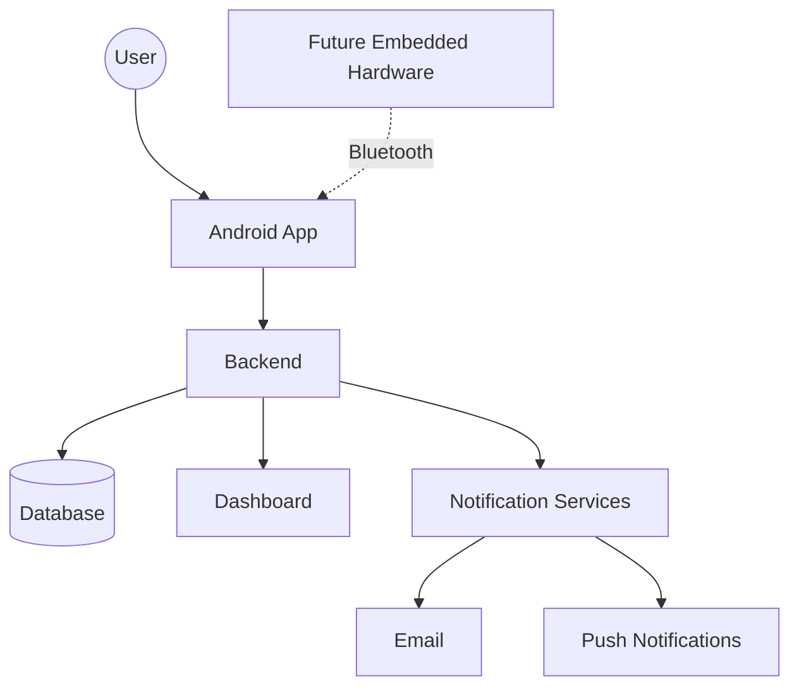
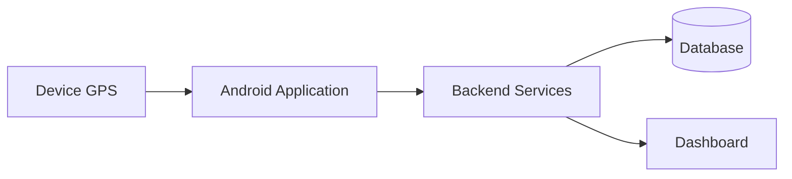
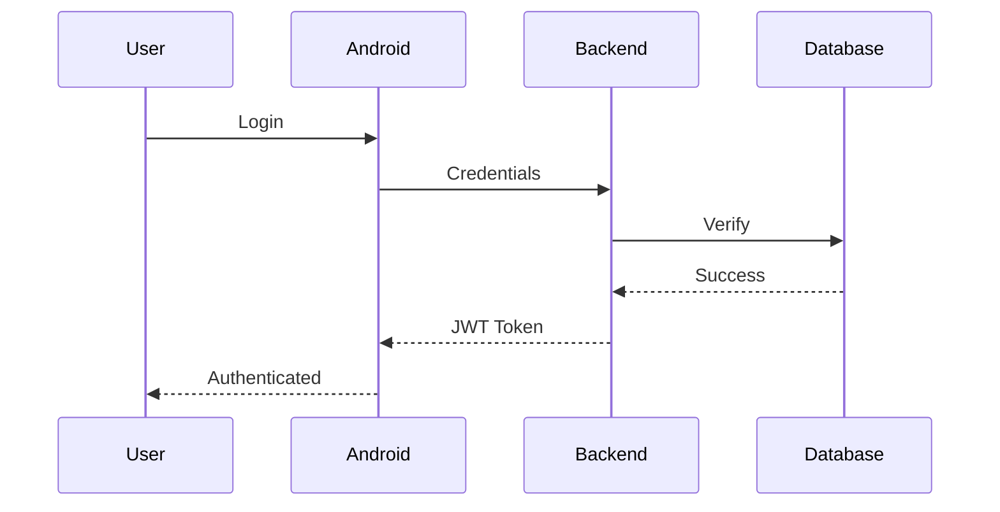
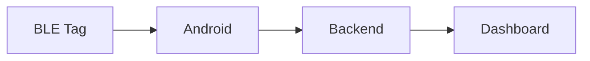
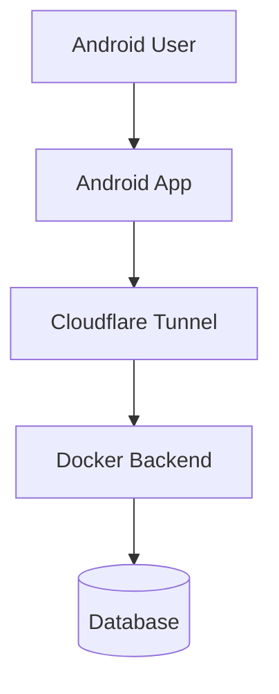

# Magneetar Architecture
**Version:** 1.0

**Status:** Draft

**Last Updated:** 2026-07-21

**Author:** Oluwanifemi Tinubu
---

# Table of Contents

- [1. Introduction](#1-introduction)
- [2. Vision](#2-vision)
- [3. Goals and Non-Goals](#3-goals-and-non-goals)
- [4. System Overview](#4-system-overview)
- [5. Logical Architecture](#5-logical-architecture)
- [6. Data Flow](#6-data-flow)
- [7. Security Architecture](#7-security-architecture)
- [8. Technology Stack](#8-technology-stack)
- [9. Deployment Architecture](#9-deployment-architecture)
- [10. Future Hardware Integration](#10-future-hardware-integration)
- [11. Reliability Architecture](#11-reliability-architecture)
- [12. Design Principles](#12-design-principles)
- [13. Architecture Evolution](#13-architecture-evolution)
- [13. References](#13-references)
- [14. Revision History](#14-revision-history)

## 1. Introduction

Magneetar is a secure, intelligent, and extensible anti-theft ecosystem designed to protect valuable assets through the integration of mobile applications, cloud services, web technologies, and future embedded hardware.

Rather than being a standalone Android application, Magneetar is envisioned as a platform capable of evolving into a complete security ecosystem. The system is designed to provide reliable asset tracking, intelligent theft detection, secure communication, evidence collection, and future hardware-assisted protection while maintaining a modular, maintainable, and scalable architecture.

This document describes the high-level architecture of the Magneetar ecosystem. It defines the major system components, their responsibilities, how they communicate, and the engineering principles that guide the evolution of the project.

The purpose of this document is to provide a shared understanding of the system architecture for current and future development. It serves as the primary architectural reference for Magneetar and should be updated whenever significant architectural changes are introduced.
## Intended Audience

This document is intended for:

- Software Engineers
- Mobile Developers
- Backend Developers
- Embedded Systems Engineers
- Security Engineers
- Future contributors to the Magneetar project

Readers are expected to have a basic understanding of software development concepts. This document focuses on architectural design rather than implementation details.

## 2. Vision

Magneetar aims to become a trusted security platform that helps individuals and organizations protect, monitor, and recover valuable assets through secure, intelligent, and connected technologies.

The long-term vision is to build an ecosystem that seamlessly integrates mobile applications, cloud infrastructure, web services, and embedded hardware into a unified platform capable of adapting to evolving security challenges.

Magneetar is designed with a strong emphasis on security, reliability, scalability, maintainability, and continuous innovation. Every architectural and engineering decision should contribute toward building a dependable platform that can evolve over time without compromising these principles.
> Build systems that earn trust through thoughtful engineering, strong security, and continuous improvement.

## 3. Goals and Non-Goals

### Goals

The primary architectural goals of Magneetar are:

- Build a secure and trustworthy anti-theft ecosystem.
- Protect user privacy and sensitive information through secure system design.
- Maintain a modular architecture that supports independent evolution of system components.
- Design for scalability to accommodate future growth in users, devices, and services.
- Ensure reliability and resilience under varying network and operational conditions.
- Support future integration with embedded hardware and Internet of Things (IoT) devices.
- Promote maintainability through clean architecture, documentation, and engineering best practices.
- Enable continuous improvement without requiring major architectural redesigns.

### Non-Goals

The following are intentionally outside the scope of the current architecture:

- Native support for non-Android mobile platforms.
- Multi-region or globally distributed cloud deployments.
- Full enterprise asset management capabilities.
- AI-driven behavioral analysis as a core system dependency.
- Integration with third-party security ecosystems before the core platform is mature.

These non-goals may be revisited as the project evolves.
## Core Values

Every architectural decision within Magneetar should uphold the following values:

- Security by Design
- Reliability
- Simplicity where possible
- Scalability where necessary
- Respect for User Privacy
- Transparency
- Maintainability
- Continuous Improvement

## 4. System Overview

Magneetar follows a modular, client-server architecture in which multiple clients communicate with a centralized backend responsible for coordinating system operations, enforcing business logic, and managing persistent data.

The architecture is designed to separate responsibilities across independent components, allowing each subsystem to evolve without unnecessarily affecting the others.

At a high level, the ecosystem consists of mobile clients, backend services, data storage, web interfaces, notification services, and future embedded hardware components working together to provide a secure and reliable asset protection platform.


## 5. Component Architecture

### 5.1 Android Application

#### Purpose

The Android application serves as the primary client interface between the user and the Magneetar ecosystem. It is responsible for interacting with device hardware, collecting telemetry, and providing users with secure access to Magneetar services.

#### Responsibilities

- User authentication
- Device registration
- Asset tracking
- Location acquisition
- Local data storage
- Offline operation where applicable
- Communication with backend services
- Displaying notifications and alerts

#### Interfaces

- Backend API
- Android Location Services
- Bluetooth (future)
- Camera (future)
- Push Notifications

#### Future Evolution

- BLE hardware integration
- Intelligent theft detection
- Enhanced offline synchronization
- Additional sensor support

### 5.2 Backend Services

#### Purpose

Backend Services provide the central coordination point of the Magneetar ecosystem. They manage business logic, authentication, data processing, and secure communication between system components.

#### Responsibilities

- Authentication and authorization
- Device management
- Telemetry processing
- Alert generation
- Evidence management
- Notification orchestration
- API management
- System administration

#### Interfaces

- Android Application
- Dashboard
- Database
- Notification Services
- Future Hardware Services

#### Future Evolution

- AI-assisted analysis
- Guardian Network coordination
- Advanced analytics
- Distributed service architecture

### 5.3 Database

#### Purpose

The database provides persistent and reliable storage for information generated and managed throughout the Magneetar ecosystem.

#### Responsibilities

- Store user accounts
- Store registered devices
- Store telemetry
- Store evidence
- Store audit logs
- Store application configuration

#### Interfaces

- Backend Services only

#### Future Evolution

- Database replication
- Backup automation
- Encryption at rest
- Performance optimization

### 5.4 Dashboard

#### Purpose

The Dashboard provides administrators and authorized users with a web-based interface for monitoring, managing, and analyzing information within the Magneetar ecosystem.

#### Responsibilities

- Device monitoring
- Live map visualization
- Alert management
- Administrative functions
- Reporting
- Evidence review

#### Interfaces

- Backend Services

#### Future Evolution

- React-based interface
- Advanced analytics
- Multi-user administration
- Organization management

### 5.5 Notification Services

#### Purpose

Notification Services deliver timely alerts and important system events to users through multiple communication channels.

#### Responsibilities

- Push notifications
- Email notifications
- Future SMS notifications
- Guardian Network alerts

#### Interfaces

- Backend Services
- External notification providers

#### Future Evolution

- Multi-channel delivery
- Delivery tracking
- Notification preferences

### 5.6 Future Embedded Hardware

#### Purpose

Embedded hardware extends Magneetar beyond software by providing dedicated low-power devices capable of enhancing asset protection and recovery.

#### Responsibilities

- BLE communication
- Sensor acquisition
- Low-power operation
- Device identification
- Firmware execution

#### Interfaces

- Android Application
- Backend Services (through Android)

#### Future Evolution

- Custom PCB design
- Secure hardware authentication
- Environmental sensing
- OTA firmware updates

### 6.1 Asset Tracking Flow

The primary tracking workflow begins when the Android application acquires location data from the device.

The application validates and prepares the telemetry before securely transmitting it to the backend.

The backend authenticates the request, processes the received telemetry, stores relevant information in the database, and makes the processed data available to authorized clients such as the Dashboard.

This architecture ensures that all tracking information passes through a centralized backend before becoming available to other components.


### 6.2 Authentication Flow




## Communication Principles
- All external communication must occur over encrypted channels.

- Clients communicate with the backend rather than directly with the database.

- Sensitive operations require authentication and authorization.

- Data validation is performed before persistence.

- Every component communicates only through documented interfaces.

## 7. Security Architecture

Security is a foundational design principle of the Magneetar ecosystem. Every component, communication channel, and data flow should be designed with confidentiality, integrity, availability, and accountability in mind.

Rather than relying on a single security mechanism, Magneetar adopts a defense-in-depth approach in which multiple independent security controls work together to reduce risk and improve resilience.

Security requirements should be considered throughout the software development lifecycle, from architectural design to implementation, testing, deployment, and maintenance.

### 7.1 Security Principles

#### Confidentiality

Sensitive information should only be accessible to authorized users and services.

#### Integrity

System data must remain accurate and protected against unauthorized modification.

#### Availability

Critical services should remain accessible and reliable under expected operating conditions.

#### Accountability

Security-relevant actions should be traceable through appropriate logging and auditing mechanisms.

### 7.2 Authentication

Every request to protected backend resources must be authenticated.

Authentication mechanisms should support secure identity verification while remaining extensible for future enhancements.

### 7.3 Secure Communication

Communication between system components should occur over encrypted channels.

Sensitive information must not be transmitted in plain text.

All external interfaces should validate incoming requests before processing them.

### 7.4 Secrets Management

Sensitive credentials, API keys, tokens, and other secrets must never be stored directly in source code or committed to version control.

Secrets should be managed using appropriate configuration and secret management mechanisms.

### 7.5 Logging and Auditing

Security-relevant events should be logged to support monitoring, troubleshooting, and incident investigation.

Logs should avoid exposing sensitive information while providing sufficient detail for operational analysis.

### 7.6 Future Security Enhancements

Future versions of Magneetar may include:

- Device attestation
- Multi-factor authentication
- Hardware-backed cryptographic keys
- End-to-end encryption for selected data
- Advanced anomaly detection
- Security event monitoring

### Security Mindset

Security is a shared responsibility across every layer of the Magneetar ecosystem.

Engineering decisions should prioritize reducing unnecessary complexity, minimizing attack surfaces, applying the principle of least privilege, and protecting user privacy throughout the system lifecycle.

## 8. Technology Stack

The Magneetar ecosystem uses carefully selected technologies that prioritize security, maintainability, scalability, and long-term support.

| Component | Planned Technology | Rationale |
|-----------|--------------------|-----------|
| Mobile Application | Kotlin | Native Android development with modern language features |
| Backend Services | FastAPI (Python) | High-performance APIs, strong typing, and rapid development |
| Database | PostgreSQL (planned) | Reliable relational database with strong consistency |
| Dashboard | React + TypeScript | Maintainable and scalable web interface |
| Containerization | Docker | Consistent development and deployment environments |
| Version Control | Git & GitHub | Source control and collaboration |
| CI/CD | GitHub Actions | Automated testing and deployment workflows |
| Reverse Proxy / Tunnel | Cloudflare Tunnel | Secure external access without exposing infrastructure |
| Operating System | Ubuntu LTS | Stable long-term development platform |

## 9. Deployment Architecture

During development, Magneetar components are deployed independently to simplify testing and maintenance.

The Android application runs on user devices.

Backend services execute within Docker containers hosted on Ubuntu.

Persistent application data is stored in a dedicated database.

External communication is secured through Cloudflare Tunnel and encrypted network protocols.

Future production deployments may include dedicated cloud infrastructure, automated scaling, and redundant services.



## 10. Future Hardware Integration

Magneetar is designed with future embedded hardware integration in mind.

Dedicated low-power hardware devices will extend the ecosystem by providing capabilities beyond those available through smartphones alone.

Potential future hardware capabilities include:

- Bluetooth Low Energy (BLE) asset tags
- Custom embedded firmware
- Sensor-based theft detection
- Battery-efficient location assistance
- Secure device pairing
- Firmware update mechanisms

The software architecture has been intentionally designed to accommodate these future components without requiring significant architectural redesign.

## 11. Reliability Architecture

Magneetar incorporates several reliability patterns across the stack to ensure
system resilience under varying operational conditions.

### 11.1 WebSocket Connection Management

Dashboard WebSocket connections are bounded to prevent resource exhaustion.
Up to **100 concurrent connections** are allowed; beyond that, the oldest
connection is evicted with a `1013` close code. A background heartbeat task
runs every **30 seconds**, sending a `{"type": "ping"}` message to every
connection. Connections that fail to receive the ping (half-open TCP) are
silently pruned and logged.

```python
# websocket_manager.py
MAX_DASHBOARD_CONNECTIONS = 100

# Lifespan startup (main.py)
await start_connection_heartbeat(interval=30)
```

**Rationale:** WebSocket `send_json()` raises an exception on dead connections,
making it a reliable detector of silently-disconnected clients without requiring
application-level PONG responses.

### 11.2 Alert Delivery with Retry & Circuit Breaker

All alert channels (email, SMS, WhatsApp, push) use a retry-wrapped send
pattern with the following guarantees:

- **1 automatic retry** with 1–2 second random jitter after any failure or timeout
- **Per-channel circuit breaker**: after 5 consecutive failures, a channel is
  automatically skipped (no useless timeout waits) until the next server restart
- **Success resets** the failure counter immediately, preventing transient issues
  from permanently disabling a channel

```python
# alerts.py — retry wrapper
async def _send_with_retry(self, channel, send_fn, *args, **kwargs):
    if self._should_skip_channel(channel):
        return False  # circuit breaker open
    for attempt in range(2):
        try:
            if await send_fn(*args, **kwargs):
                self._record_success(channel)
                return True
            await asyncio.sleep(1 + random.random())  # jitter
        except Exception:
            await asyncio.sleep(1 + random.random())
    self._record_failure(channel)
    return False
```

### 11.3 Request Timeout Middleware

Every HTTP request is bounded by a configurable timeout (default **30 seconds**).
If a handler does not respond within this window, the client receives a `504`
response and the handler coroutine is cancelled, preventing resource leaks from
stuck database queries or external API calls.

```python
# config.py
REQUEST_TIMEOUT_SECONDS: int = env("MT_REQUEST_TIMEOUT", "30")
```

### 11.4 Health Endpoint with Dependency Checks

The `/health` endpoint now verifies:
- **Database connectivity**: runs `SELECT 1` and reports `database: true/false`
- If the database is unreachable, `status` changes to `"degraded"`

```json
// Normal
{"status": "online", "database": true, "version": "1.0.0", ...}

// Degraded
{"status": "degraded", "database": false, "version": "1.0.0", ...}
```

### 11.5 Graceful Shutdown

On shutdown, the server:
1. Cancels background tasks (heartbeat, rate-limit cleanup)
2. Notifies all connected WebSocket clients with `{"type": "shutdown", "reconnect": true}`
3. Waits up to 500ms for the notification to be delivered
4. Clears all connection state

This allows the dashboard to immediately reconnect to a new instance without
user-visible disruption.

### 11.6 Startup Validation

A pre-flight validation script (`scripts/validate-startup.sh`) must pass before
the server starts:
- Environment variable completeness and format validation
- Database directory writability check
- Required port availability
- Critical Python dependency check
- Disk space warning at < 100 MB free

### 11.7 Reliability Testing

- **Unit tests** in `server/tests/test_reliability.py` cover:
  - WebSocket connection limits and eviction
  - Stale connection pruning
  - Alert retry and circuit breaker behavior
  - Health endpoint with database offline check
- **E2E reliability suite** in `scripts/reliability-test.sh` simulates real
  failure scenarios against a running instance

## 12. Design Principles

Magneetar follows a set of design principles that guide architectural and engineering decisions. These principles are intended to be stable, technology-agnostic, and applicable across all components of the system.

## 13. Architecture Evolution

The Magneetar architecture is intended to evolve alongside the project.

Architectural improvements should be driven by new requirements, operational experience, technological advancements, and lessons learned during development.

Significant architectural changes should be documented through Architecture Decision Records (ADRs) and reflected within this document where appropriate.

## 13. References

- Magneetar Roadmap
- Architecture Decision Records (ADR)
- FastAPI Documentation
- Android Developers Documentation
- Docker Documentation
- GitHub Documentation
- OWASP Application Security Verification Standard (ASVS)

## 14. Revision History

| Version | Date | Description |
|---------|------|-------------|
| 1.0 | 2026-07-21 | Initial architecture document |

